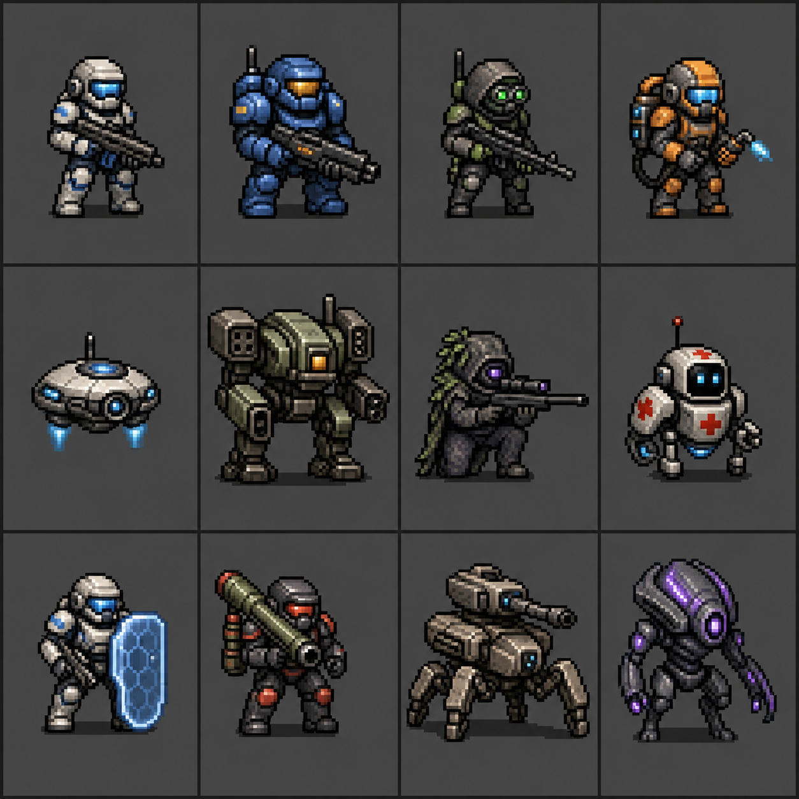
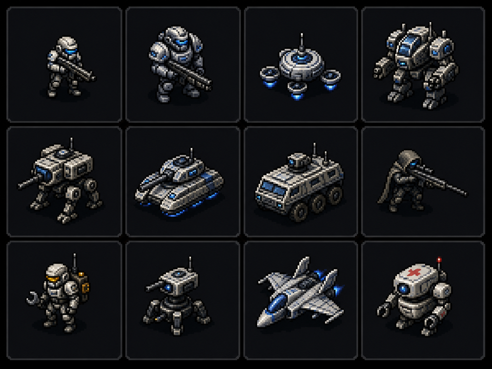
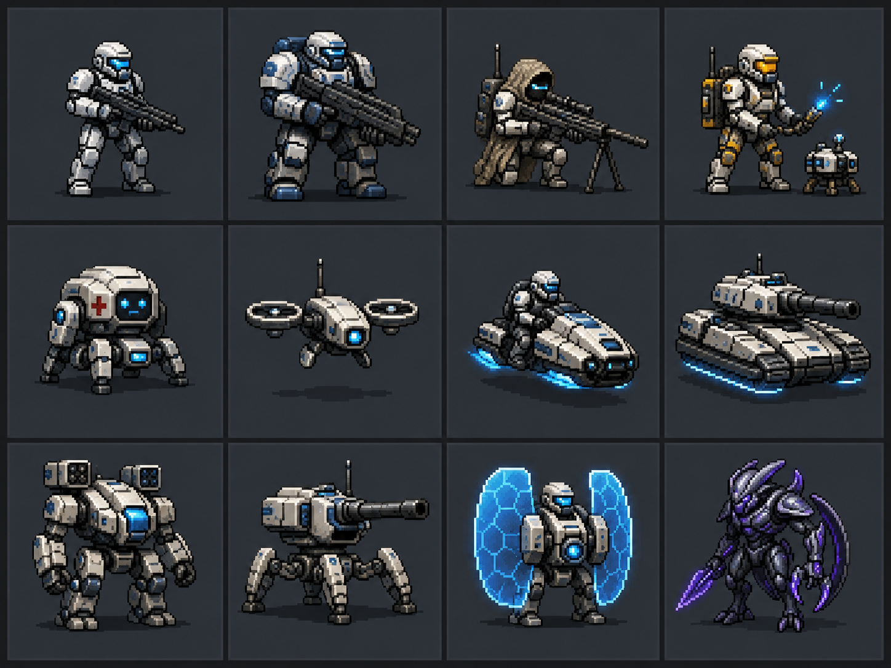

# Convert faux-pixel-art sprite sheets

Date: 2026-09-01

## User

> These are images of sprite sheets, but they are not "true pixel art" because
> each "pixel" is greater than one PNG data pixel. I could convert these to
> true pixel art sprite sheets by figuring out the approximate color of each
> upscaled pixel and recreating the true pixel art sprite in Aseprite, but I am
> sure there is a reliable automated way to do this using computer vision,
> modern AI, or an image-analysis color-bounding algorithm.
>
> What is the best way to convert these to true pixel art sprites?

Attached reference sheets:

## Assistant

The sheets are AI-generated faux pixel art rather than exact nearest-neighbor
enlargements. A pixel-boundary alignment test found no strong global lattice,
so there is no hidden low-resolution original that can be recovered exactly.
The best method is deterministic reverse rasterization, not generative AI:

1. Split the sheets into cards and remove borders, backgrounds, and cast
   shadows.
2. Choose the intended logical canvas, normally 64x64 for Automapolis, and use
   one common scale and pivot for related frames.
3. Downsample premultiplied RGBA with area/box resampling. For a genuinely
   integer-scaled source, instead recover each macro-pixel with its median or
   modal color.
4. Threshold alpha to binary, quantize to a shared palette in a perceptual
   color space without dithering, and remove isolated one-pixel noise.
5. Inspect at native size in Aseprite and do a short silhouette and cluster
   cleanup pass.

The repository's `tools/build_generated_unit_sprites.py` already performs much
of the last half of this pipeline. For these sheets, it should gain a card
splitter and background-mask stage, resize with BOX/area rather than LANCZOS,
and resize premultiplied color and alpha to avoid halos. Generative AI is useful
only as an optional masking aid; using it for the core conversion would invent
details and make frames inconsistent.
