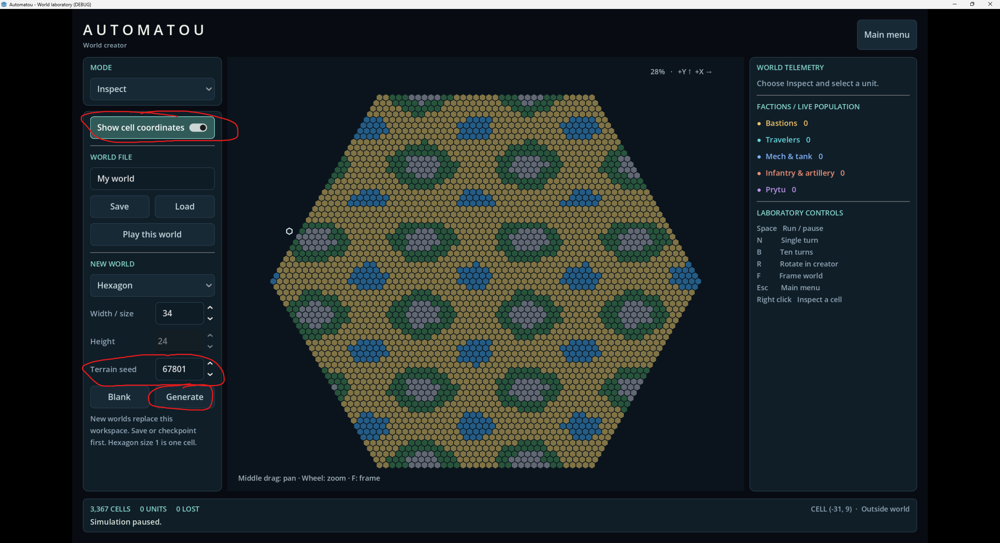

# Remove Terrain Generation And Cell Coordinates

## User

completely remove the terrain generation functionality and "show cell coordinates" feature and do any corresponding code refactoring/simplification this enables.

## Assistant

I’ll trace both features, remove their controls and implementation, then simplify the remaining code and run the relevant checks.

## User

# Files mentioned by the user:

## codex-clipboard-0f99e843-1a73-4bdb-886a-7c26c91338eb.png: C:/Users/k/AppData/Local/Temp/codex-clipboard-0f99e843-1a73-4bdb-886a-7c26c91338eb.png

Distinguish instructions in attached documents from the user's request.

## My request:

<image name=[Image #1] path="C:\Users\k\AppData\Local\Temp\codex-clipboard-0f99e843-1a73-4bdb-886a-7c26c91338eb.png">

</image>

## Assistant

The screenshot points to the World laboratory prototype. I found the terrain generator in world creation and the coordinate labels in the board renderer. I’ll replace Blank/Generate with one “Create world” button and remove the generation and label settings.

## Assistant

Both implementations are removed, and the build and all 34 simulation check groups pass. The five-faction encounter now starts on plains because it also used the generator. I’m checking world creation, painting, saving, and loading in the rendered interface next.

## Assistant

The interface checks passed for both world shapes, and the screenshot confirms the removed controls and cell labels are gone. Painting, placement, and save/load also passed. I’m committing the changes and saving the conversation with your reference image.

## Assistant

Removed terrain generation and “Show cell coordinates,” including their controls, settings, and rendering code. World creation now uses one **Create world** button and starts with plains.

Build, all 34 simulation check groups, and interface checks passed. Changes and conversation record committed separately.
