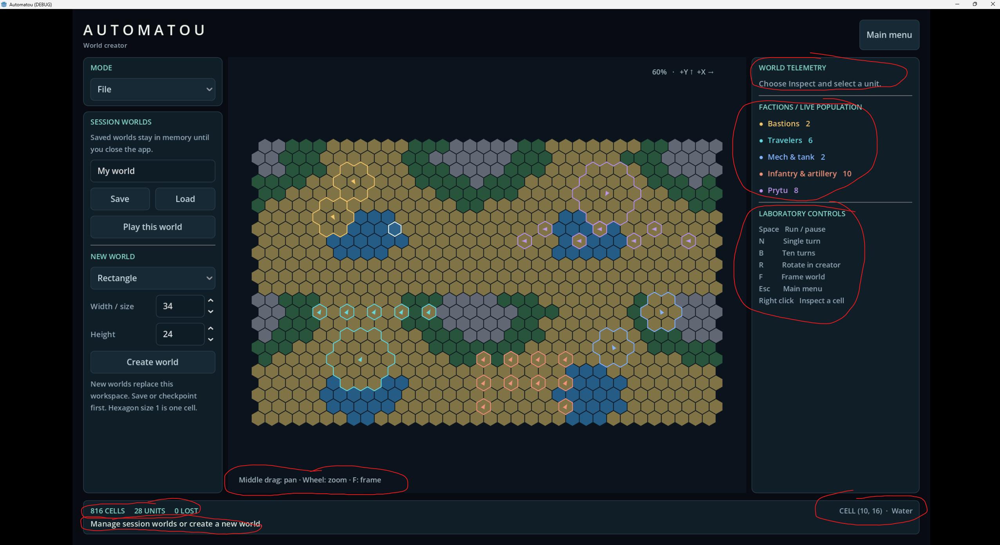

# Explain Circled Interface Elements

## User

# Files mentioned by the user:

## codex-clipboard-9c00c324-62ed-47df-a0ee-3b94dafb95b8.png: C:/Users/k/AppData/Local/Temp/codex-clipboard-9c00c324-62ed-47df-a0ee-3b94dafb95b8.png

Distinguish instructions in attached documents from the user's request.

## My request:
explain each of the circled interface elements. i suspect that some of these elements may be unnecessary or not working properly.

## Assistant

I’ll trace the circled elements in the code to explain what they do and check for misleading labels or controls that don’t work in this mode.

## Assistant

The shortcut panel has a clear mismatch: it advertises Space, N, and B in World Creator, but those keys only operate the simulation in World mode. The cell readout can also stay stale because it updates only when the mouse moves over the board. I’m finishing the remaining checks and recording the explanation and screenshot as required by the repository instructions.

## Assistant

Your suspicion is partly correct: **some labels are misleading or shown in the wrong mode, and the cell readout can become stale.** These findings come from inspecting the code; I haven’t tested the running application.

1. **WORLD TELEMETRY**
   This is actually the **selected-unit inspector**. Selecting a unit shows its health, heat, current intention, behavior history, tuning, and statistics. With nothing selected, it displays the instruction shown.
   
   **Assessment:** useful, but “Unit inspector” would be clearer. In File mode, the empty prompt contributes little. Right-clicking a unit automatically switches to Inspect.

2. **FACTIONS / LIVE POPULATION**
   A color legend and count of existing units in each faction. Your counts add up to **28**, matching the footer. A large unit spanning several hexes still counts as one unit.
   
   **Assessment:** functional, but optional in the creator. One inconsistent behavior: this list disappears when a selected unit’s Behavior or Tuning tab is active, but remains on its Unit tab.

3. **LABORATORY CONTROLS**
   This is static shortcut help, not a set of clickable controls:
   - **Space:** run/pause, **only in World mode**.
   - **N:** pause and advance one turn, **only in World mode**.
   - **B:** pause and advance ten turns, **only in World mode**.
   - **R:** rotate placement facing by 60° in the creator; in Inspect, also rotate the selected unit. In File mode it changes placement facing without an immediate visible effect.
   - **F:** center and zoom to fit the whole world.
   - **Esc:** return to the main menu.
   - **Right click:** switch to Inspect and select the unit occupying that cell. Empty cells yield no unit details.
   
   **Assessment:** this is the clearest problem. It advertises simulation shortcuts that do nothing on the screen shown. “Inspect a cell” also overstates what right-click provides. The help should depend on the current mode, and “Laboratory” is an unclear heading.

4. **Middle drag: pan · Wheel: zoom · F: frame**
   Hold the middle mouse button and drag to move the view; scroll to zoom around the pointer; press F to fit the world.
   
   **Assessment:** all three have implementations. This is useful help, though F duplicates the sidebar entry. Keyboard shortcuts are suppressed while editing text fields.

5. **816 CELLS · 28 UNITS · 0 LOST**
   **816** is the world’s total cell count: 34 × 24. **28** is the current unit count. **0 LOST** counts simulation deaths, including combat and fatal rough-terrain crossings. Manually erasing a unit does **not** increase LOST.
   
   **Assessment:** the counts are backed by world state. CELLS and UNITS are useful creator information; LOST is primarily simulation information and could be hidden in the creator.

6. **Manage session worlds or create a new world**
   This is the shared **status-message area**, currently showing the message produced when selecting File. Other actions replace it with save confirmations, placement feedback, or errors.
   
   **Assessment:** retain the status area, but this particular instruction is redundant. It can also become misleading: right-click switches to Inspect without updating this message.

7. **CELL (10, 16) · Water**
   Displays the hovered cell’s X/Y coordinates and terrain, independently of unit selection.
   
   **Assessment:** useful for editing, but it updates only on mouse movement over the board. It is not cleared when the pointer leaves, and painting or replacing the world can leave its terrain text outdated until the pointer moves again.

I’d prioritize **mode-specific shortcut help, fixing the stale hover/status text, and showing the unit inspector when it is relevant**. No application code was changed.
