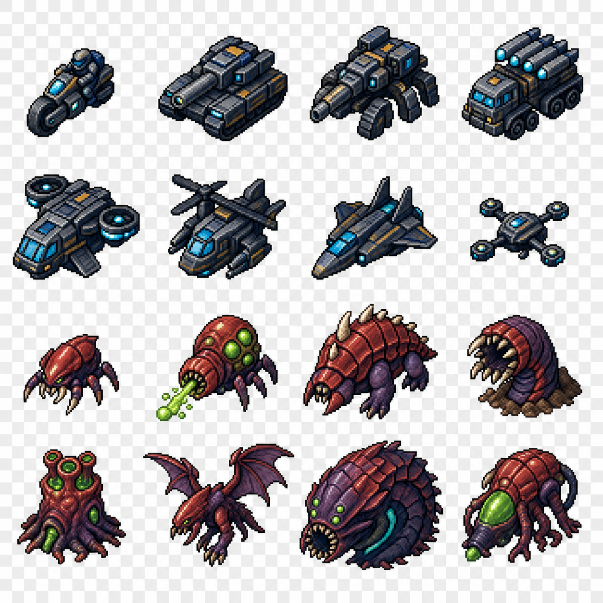
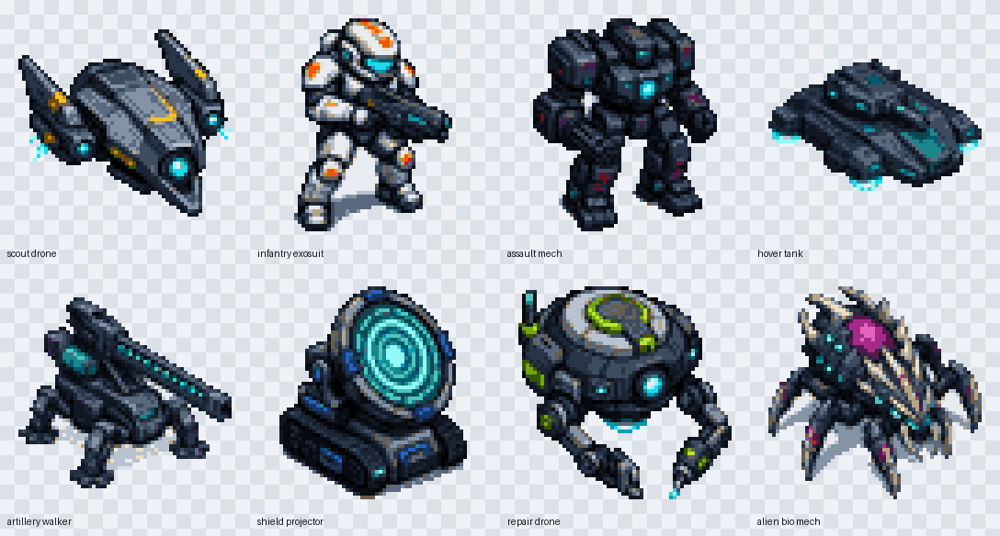
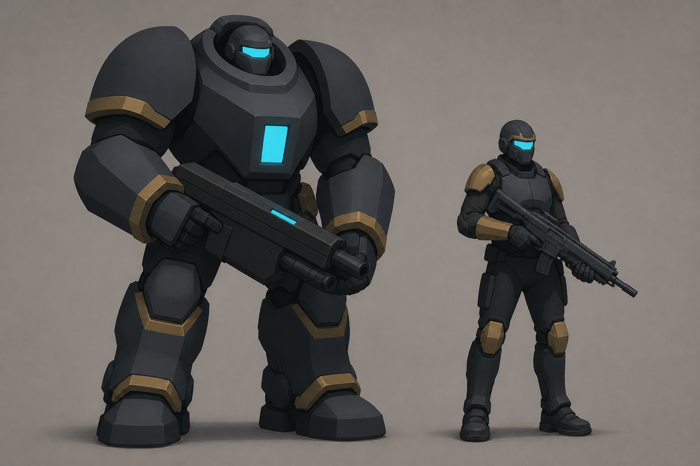
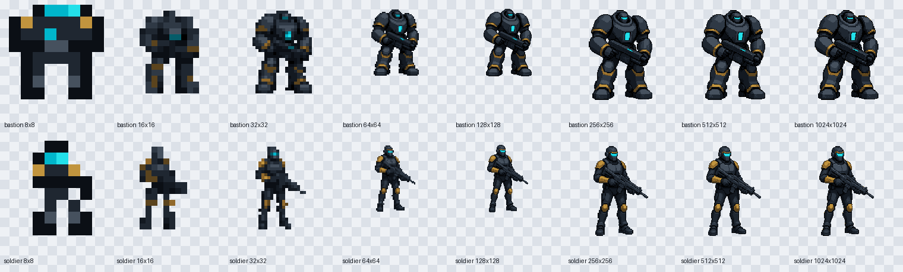
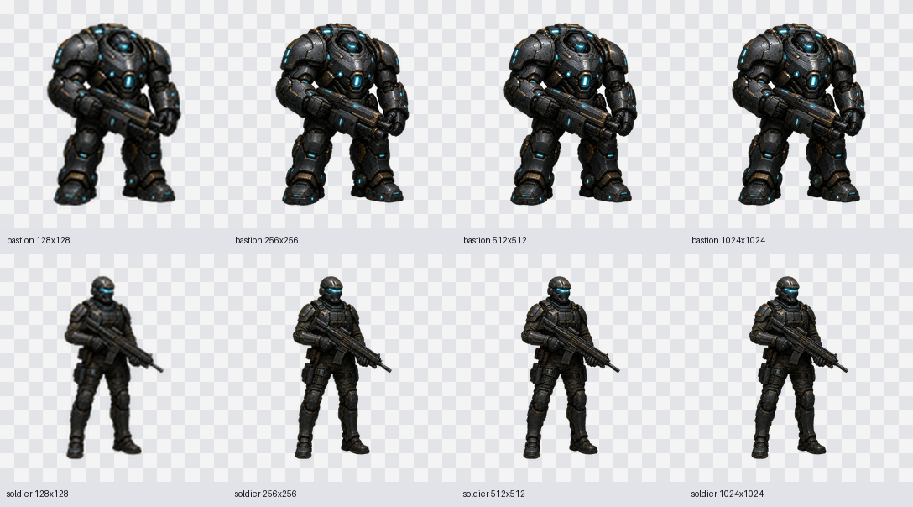

# Art direction

Automapolis uses original 16x16 tactical pixel art with the compact readability of classic console and handheld turn-based strategy games. The production assets are not generated by an image model: their authoritative source is the palette-indexed [`sprites.json`](../Shells/Godot/assets/sprites/sprites.json), compiled deterministically into PNG files.

## Visual conflict

The two sides must read before the individual unit does:

- humanity uses squared armor, deliberate symmetry, gunmetal, ward-cyan, and command gold;
- the aliens use low predatory silhouettes, branching limbs, wet reds, bruise-purple, and toxic green;
- human terrain is reinforced and geometric, while alien terrain looks grown and interconnected;
- the Bastion is a bulky, intimidating, roughly human-shaped wall of armor with oversized shoulders, a recessed helmet, a cyan core, and gold command plating;
- the soldier is recognizably human and armored, but slimmer, lighter, and more conventionally equipped than the Bastion.

## Visual grammar

- Square 16x16 canvas and nearest-neighbor display.
- Top-down/three-quarter tactical viewpoint with a fixed upper-left light.
- One shared palette with deep navy outlines and sharply separated human and alien accents.
- Terrain fills its square. Forces, buildings, and organisms use transparency and layer over terrain.
- Strong silhouettes take priority over internal detail.
- Selection, damage, ownership, and targeting remain separate Shell overlays.

## Unit roster expansion

This generated design sheet established a broader silhouette vocabulary for compact tactical units: tracked armor, walkers, missile racks, lift fans, rotorcraft, aircraft, drones, arthropods, armored beasts, burrowers, rooted artillery, flyers, and biomass carriers. It is a design reference rather than production art; the authoritative game assets are the exact 16x16 palette grids in `sprites.json`.

The production roster deliberately reduces each design to one dominant outline and one signature feature. Human machines share squared gunmetal construction, cyan energy, and restrained gold command marks. Alien organisms share red carapace, purple flesh, toxic green organs, asymmetry, and branching limbs.

### 64x64 unit exploration

The [`64x64 sci-fi unit catalog`](art/sci-fi-units-64/catalog.html) explores a
higher-resolution tactical style across eight combat and support silhouettes.
Each individual PNG has true hard alpha, a controlled palette, and exact 64x64
dimensions. This collection is an art-direction candidate rather than a
replacement for the current deterministic 16x16 production atlas.

## Bastion and soldier concept

This detailed comparison sheet established the shape language for human forces. The Bastion is a walking fortress whose recessed operator, immense shoulder mass, powered joints, and heavy weapon make it immediately distinct from the conventionally proportioned, mobile Soldier.

### Simplified sprite-translation concept

This deliberately low-detail sheet is the authoritative concept reference for future low-resolution sprite work. It preserves the approved proportions and identity while collapsing armor, weapons, and color accents into large continuous masses. Low-resolution translations should begin with these silhouettes and value groups instead of trying to interpret the detailed surface construction of the original concept.

The essential landmarks are:

- Bastion: enormous shoulder domes, recessed helmet and cyan visor, broad chest block with one cyan core, huge gauntlets, a rectangular heavy weapon, and block-like legs and boots;
- Soldier: conventional human proportions, one cyan visor, compact shoulder pads, a simple chest plate, restrained limb armor, and a recognizable service rifle;
- both: dark gunmetal bodies, a few large gold accent groups, and no dependency on tiny panels, cables, lights, pouches, scratches, or other surface texture.

### Simplified-concept pixel sprites

The [`8x8` through `1024x1024` pixel-sprite catalog](art/pixel-sprites/catalog.html) translates the simplified concept into a compact twelve-color palette with true transparency and hard pixel edges. The 8x8 versions are deliberate icon-scale abstractions that preserve only silhouette, visor, core, gold armor grouping, and weapon direction. From 16x16 upward, the designs progressively recover the large forms of the generated pixel-art masters without reintroducing the original concept's surface noise.

### Resolution studies

The [`8x8` through `128x128` pixel-art catalog](art/sprite-studies/catalog.html) records an unsuccessful attempt to translate the concept into a hard-pixel aesthetic. It remains process history, but it is superseded by the full-color render approach below.

### Full-color sprite renders

The [`128x128` through `1024x1024` render catalog](art/sprite-renders/catalog.html) isolates each character from the approved concept and preserves the original painted design. The 1024x1024 cutouts are the masters; 512x512, 256x256, and 128x128 are direct high-quality downscales rather than separate reinterpretations.

## Historical direction reference

This image was generated for the earlier general science-fantasy direction. It is retained as process history, but the current Bastion-front sprites and this document supersede its subject matter.
