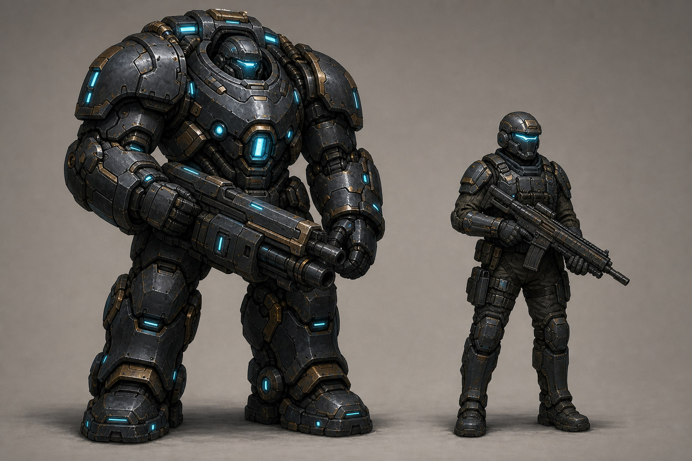
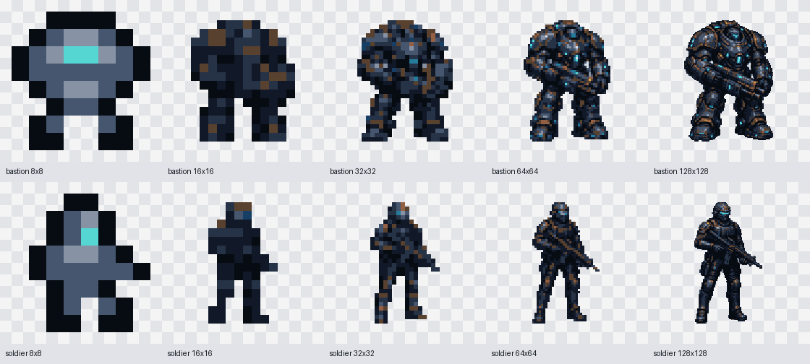
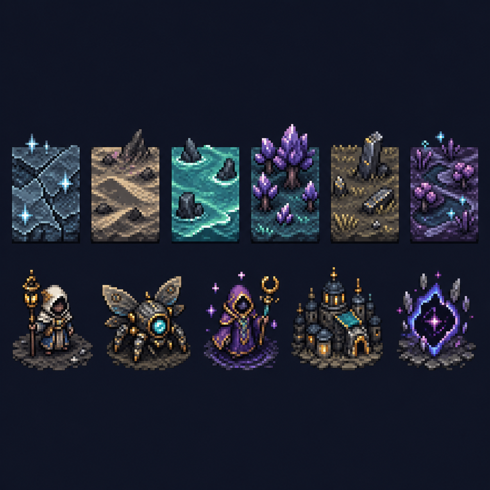

# Art direction

Automapolis uses original 16x16 tactical pixel art with the compact readability of classic console and handheld turn-based strategy games. The production assets are not generated by an image model: their authoritative source is the palette-indexed [`sprites.json`](../Shells/Godot/assets/sprites/sprites.json), compiled deterministically into PNG files.

## Visual conflict

The two sides must read before the individual unit does:

- humanity uses squared armor, deliberate symmetry, gunmetal, ward-cyan, and command gold;
- the aliens use low predatory silhouettes, branching limbs, wet reds, bruise-purple, and toxic green;
- human terrain is reinforced and geometric, while alien terrain looks grown and interconnected;
- the Bastion is a bulky, intimidating, roughly human-shaped wall of armor with oversized shoulders, a recessed helmet, a cyan core, and gold command plating;
- the soldier is recognizably human and armored, but slimmer, lighter, and more conventionally equipped than the Bastion.

## Visual grammar

- Square 16x16 canvas and nearest-neighbor display.
- Top-down/three-quarter tactical viewpoint with a fixed upper-left light.
- One shared palette with deep navy outlines and sharply separated human and alien accents.
- Terrain fills its square. Forces, buildings, and organisms use transparency and layer over terrain.
- Strong silhouettes take priority over internal detail.
- Selection, damage, ownership, and targeting remain separate Shell overlays.

## Bastion and soldier concept

This comparison sheet is the current shape-language reference for human forces. The Bastion is a walking fortress whose recessed operator, immense shoulder mass, powered joints, and heavy weapon make it immediately distinct from the conventionally proportioned, mobile Soldier. Future low-resolution sprites should preserve those silhouettes before attempting surface detail.

### Resolution studies

The [`8x8` through `128x128` sprite catalog](art/sprite-studies/catalog.html) explores how each character's defining mass, stance, weapon, and cyan energy landmarks survive at progressively tighter pixel budgets. These are review assets; choosing a production resolution remains a separate decision.

## Historical direction reference

This image was generated for the earlier general science-fantasy direction. It is retained as process history, but the current Bastion-front sprites and this document supersede its subject matter.
