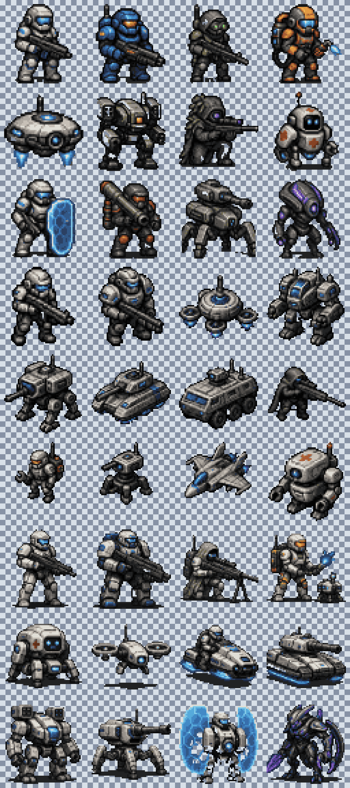

# Pixel-perfect conversion example

This directory is the reproducible output of `Automapolis.PixelPerfect` applied to
the three AI-generated reference sheets recorded with the corresponding conversation.



It contains 36 individual 64x64 RGBA sprites in `sprites`, a transparent `sheet.png`,
a nearest-neighbor `preview.png`, a shared 32-color palette in PNG and GPL formats,
and a `manifest.json` that traces each sprite back to its detected input card.

Regenerate it from the repository root:

```powershell
dotnet run --project tools/Automapolis.PixelPerfect -- `
  --input Conversations/assets/2026-09-01-convert-faux-pixel-art-sprite-sheets `
  --output docs/art/pixel-perfect-conversion-example `
  --size 64 `
  --palette-colors 32 `
  --clean
```

This set demonstrates the converter and is not an approval of every source design as
production game art. The resulting files are technically pixel-perfect and ready for
native-size art review or a final Aseprite cluster-cleanup pass.
