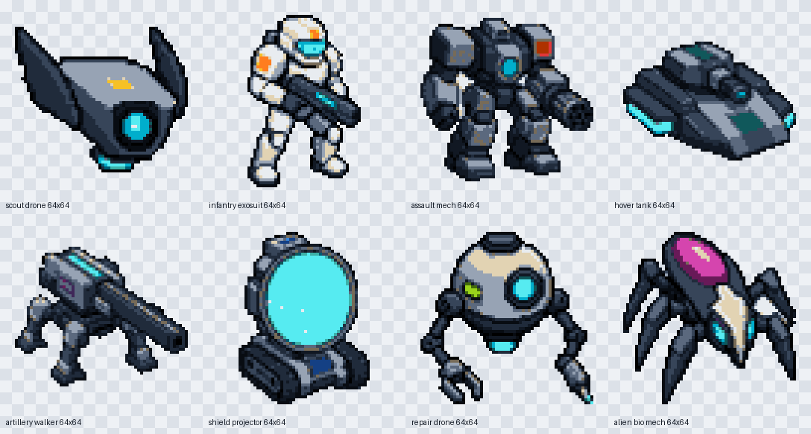
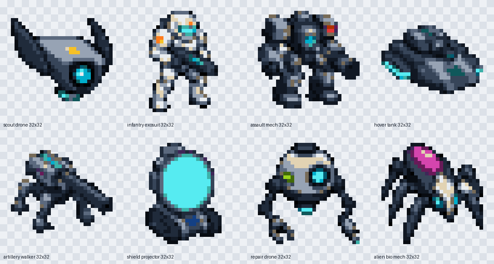

# Simplified sci-fi unit sprites, v2

This candidate iteration applies the review feedback recorded beside the
current [`64x64 golden-standard set`](../sci-fi-units-64/README.md). It preserves
the same eight-unit roster while testing a cleaner design at two exact native
resolutions.

## 64x64

## 32x32

Both directories contain eight individual RGBA PNGs, a nearest-neighbor
preview, and a machine-readable manifest. Open [`catalog.html`](catalog.html)
to compare every unit at native pixel-perfect size and enlarged without
interpolation.

## Feedback applied

- Designed for recognition at 32x32 first, then shared with the 64x64 version.
- Reduced each unit to a bold silhouette, three to five large value masses, and
  one or two oversized signature features.
- Removed rust, wear, damage, scratches, scarring, dirt, grime, tiny panel lines,
  greebles, seams, rivets, vents, cables, and decorative surface noise.
- Used clean factory-new materials, hard edges, no dithering, binary alpha, and
  a reduced cross-faction palette.
- Removed cast shadows and bases so the silhouette layers cleanly over terrain.

This is an evaluation candidate. It does not replace the current golden
standard unless it is explicitly approved after native-size review.

The built-in image generator created one simplified master per unit. The
project's [`build_generated_unit_sprites.py`](../../../tools/build_generated_unit_sprites.py)
then produced both exact sizes with its simplified palette mode. The shared
generation specification and all unit prompts are recorded in
[`prompts.md`](prompts.md).
